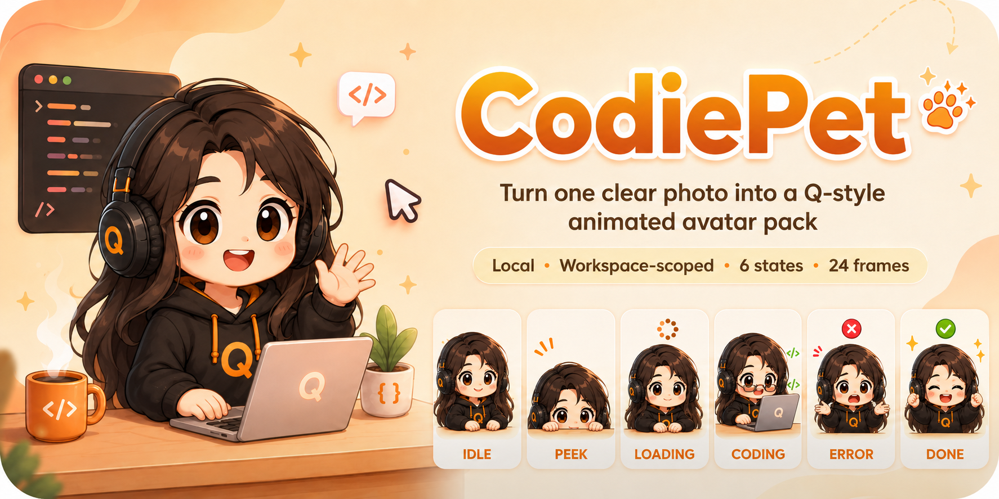

# CodiePet

[English](../../README.md) | 简体中文

<p align="center">
  
  
  
  
  
</p>

<p align="center">
  
</p>

CodiePet 是一个本地 Codex 插件，可以把一张清晰的单人照片制作成 Q 版 Codex 工作区状态头像包。

每个生成包都保存在当前工作区，结构清晰、体积小、方便验证：

```text
codie-pet/
  source/      原图和已确认的角色预览
  strips/      生成的四帧状态条带图
  frames/      拆分后的 PNG 帧
  gifs/        最终 Codex 状态 GIF
  previews/    preview.html 和 contact-sheet.png
```

## 快速安装

1. 在 Codex App 中直接让 Codex 安装：

   ```text
   Install https://github.com/hxdflying/codie-pet.git
   ```

2. 如果插件列表没有自动刷新，重启 Codex App。

3. 必要时在插件设置中启用 **CodiePet**。

4. 可选：使用 Codex CLI 安装：

   ```bash
   codex plugin marketplace add hxdflying/codie-pet
   ```

5. 可选：本地开发安装：

   ```bash
   codex plugin marketplace add .
   ```

CodiePet 没有第三方运行时 Python 包依赖。

## 状态包

| 动作 | 预览 | 使用场景 |
| --- | --- | --- |
| `idle` |  | 普通聊天、思考、轻量回答。 |
| `peek` |  | 阅读文件、检查上下文、查看预览。 |
| `loading` |  | 运行命令、等待结果、长任务处理中。 |
| `coding` |  | 写代码、编辑文件、生成资源。 |
| `error` |  | 命令失败、测试失败、任务被阻塞。 |
| `done` |  | 任务完成、结果成功。 |

每个状态都是一个四帧 GIF。当前 v0.1 包含 6 个状态，共 24 张动作帧。

## 制作你的 CodiePet

在 Codex App 中打开一个工作区，然后说：

```text
Create my CodiePet from this photo.
```

附上一张清晰的单人照片。CodiePet 会：

1. 在本地保存原图。
2. 生成一个 Q 版角色预览。
3. 等你确认这个预览。
4. 确认后生成 6 个状态 GIF。
5. 验证生成包，并询问是否安装工作区规则。

## 生成文件

生成资源会写入当前工作区：

```text
codie-pet/
  source/
    original.png
    character-preview.png
  strips/
    idle.png
    peek.png
    loading.png
    coding.png
    error.png
    done.png
  frames/
  gifs/
    idle.gif
    peek.gif
    loading.gif
    coding.gif
    error.gif
    done.gif
  previews/
    contact-sheet.png
    preview.html
  avatar.config.json
```

安装器只会更新 `AGENTS.md` 中由 CodiePet 管理的规则块。

## 范围

CodiePet v0.1 的范围刻意保持很窄：

- 支持一张清晰的单人正面人物照片。
- 不支持多人照片、宠物、物体、风景、Logo 或自定义视觉风格。
- 不修改 Codex 桌面 App 的界面。
- 不创建桌面浮窗或桌面宠物悬浮层。

## 移除

对 Codex 说：

```text
Remove CodiePet from this workspace.
```

或者运行已安装插件里的卸载脚本：

```bash
python3 /path/to/installed/codie-pet/scripts/uninstall_avatar_rules.py --workspace .
```

## 隐私

CodiePet 会把原图、已确认的角色预览、状态条带图、拆分帧和 GIF 都保存在当前工作区的 `codie-pet/` 目录下。

插件脚本不会额外增加上传步骤。图像生成由 Codex 自身的图像生成能力完成，该步骤可能使用 Codex 提供方控制的云端模型。请只使用你有权使用的照片。

查看 [隐私说明](../privacy.md) 和 [服务条款](../terms.md)。

## 开发

安装测试依赖：

```bash
python3 -m pip install -r requirements-dev.txt
```

运行测试：

```bash
python3 -m pytest tests -q
```

验证 marketplace 元数据：

```bash
python3 -m json.tool .agents/plugins/marketplace.json
python3 -m json.tool plugins/codie-pet/.codex-plugin/plugin.json
```

## 许可证

代码使用 [MIT](../../LICENSE) 许可证。
